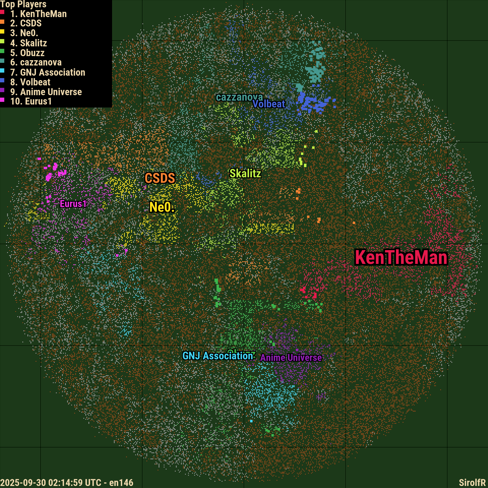
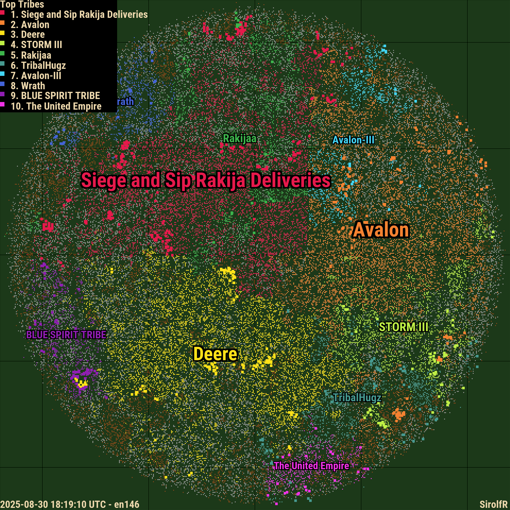

# TWMaps
Creating pretty maps for Tribal Wars with Python. Uses the TW API to retrieve world village, player and tribe files. 

# Site
The content is available on [https://www.twtimelapse.com/](https://www.twtimelapse.com/), hopefully

# Results

The following is a sample of images

# Timelapse W145 - Top 10 Players

# Timelapse W145 - Top 10 Tribes

## World 146 - Full Map

# Usage
[uv](https://docs.astral.sh/uv/) is the package manager used for this project.

1. `uv sync`
2. uv will create a virtual environment and install the dependencies.
3. You can now activate the virtual environment with `uv shell`
4. Run the script with `uv run python main.py` or `uv run python twmap/main.py`

  
Clickable Title Here

  
  Content of the collapsible section goes here.
  This can include paragraphs, lists, code blocks, etc.

