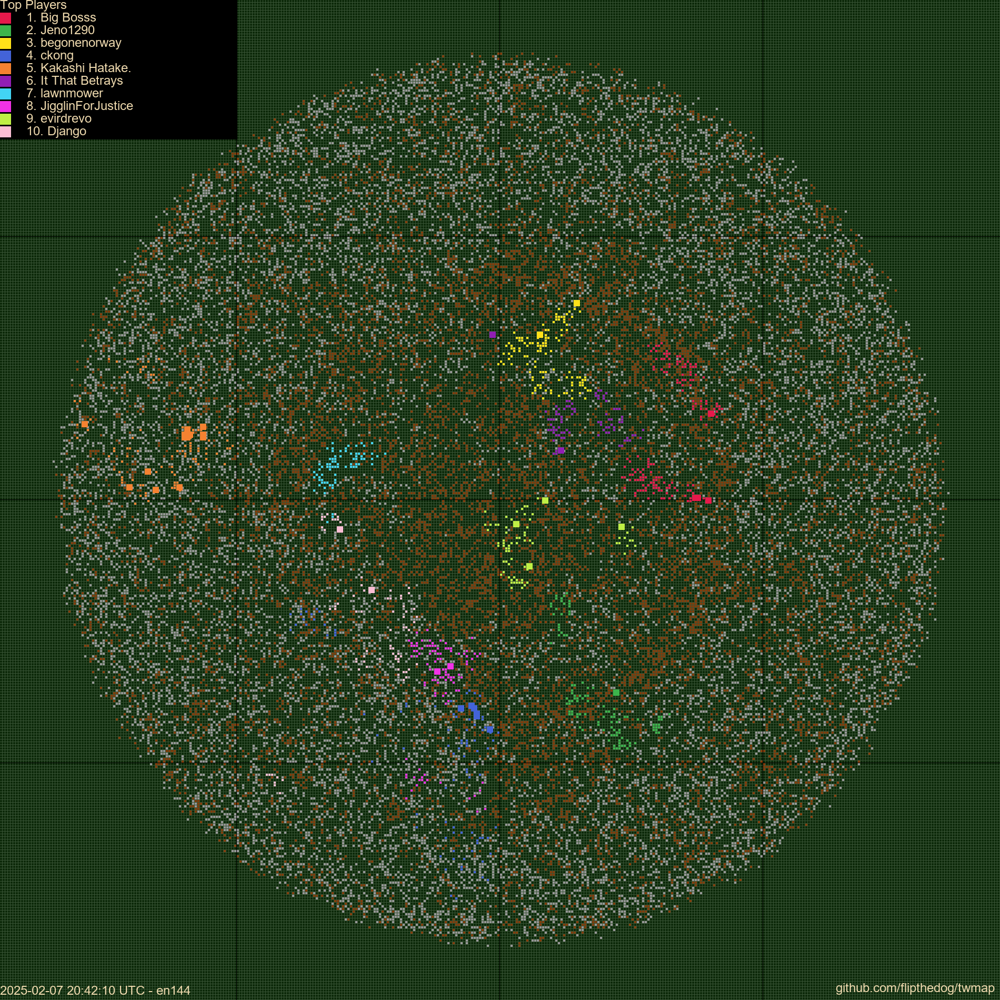

# TWMaps

Creating pretty maps for Tribal Wars with Python. Uses the TW API to retrieve world village, player and tribe files. 

# Results

The following is a sample of images

## World 144

# Usage
[poetry](https://python-poetry.org/) is the package manager used for this project.

1. `poetry install`
2. Poetry will create a virtual environment and install the dependencies.
3. You can now activate the virtual environment with `poetry shell`
4. Run the script with `python main.py` or `python twmap/main.py`

# Next Steps
1. Add cloud integration for saving to S3
2. Add cloud job scheduler for running the script
